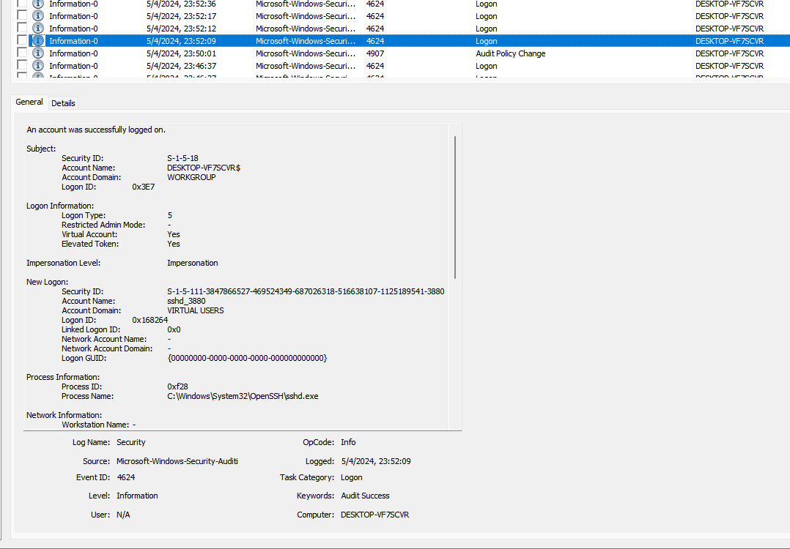
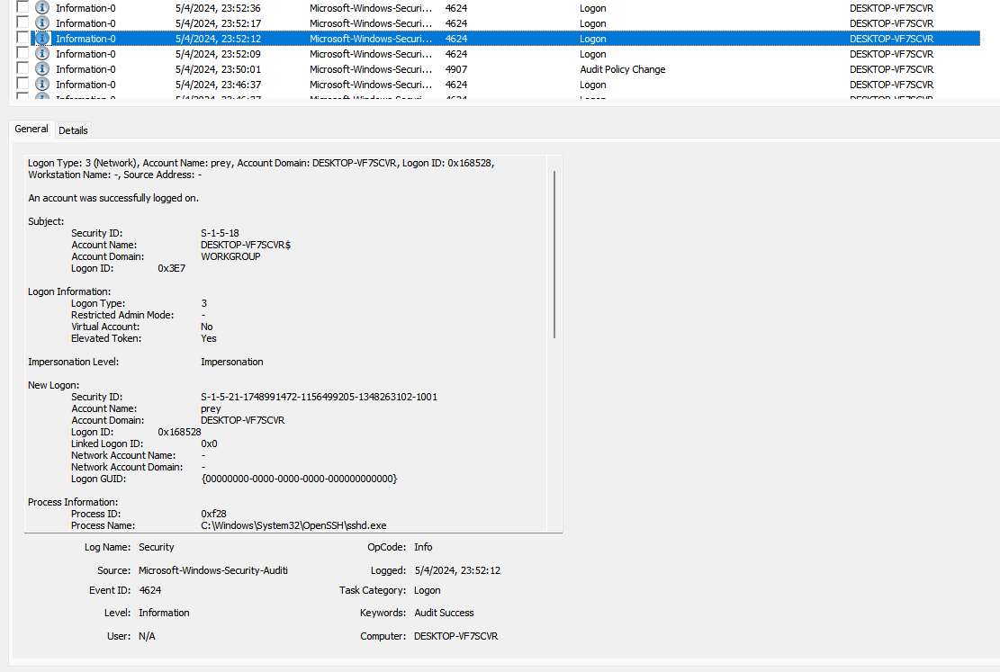
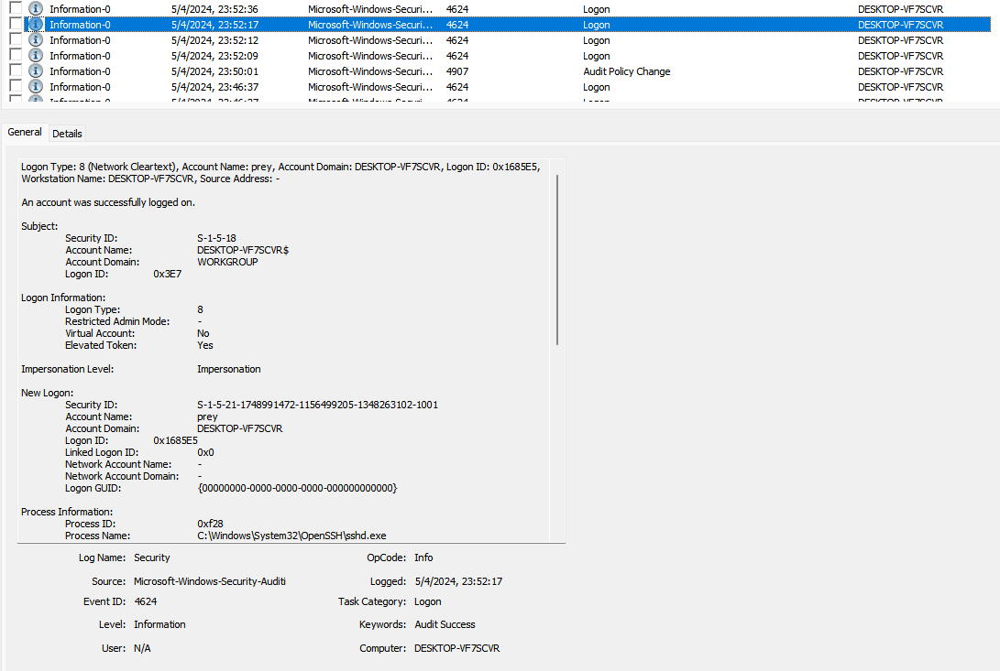
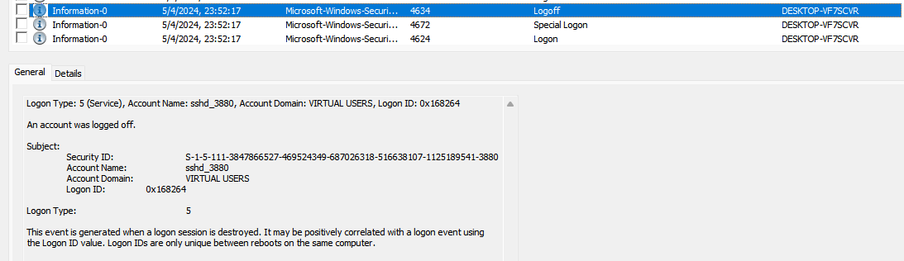

# Длинные руки

***Описание***: Что использовалось для удаленного доступа в систему?

Формат: EclipceCTF{service.extension}

---
### Решение

Для детектирования удаленного доступа проще всего воспользоваться журналами `windows`, а конкретно `security`. Фильтруем события, для отображения только `4624` - и начинаем смотреть и анализировать. Натыкаемся на `3` события с типами входа `5-3-8`, впрочем, для того чтобы сказать, какой сервис использовался - нам достаточно даже одного лога. Смотрим на поле Process Name - видим значение `C:\Windows\System32\OpenSSH\sshd.exe`

Далее можно сходить на временную метку последнего - и находим там ивент 4634 типа 5 - с очень интересным Account Name)

---

***Флаг***: `EclipceCTF{sshd.exe}`

