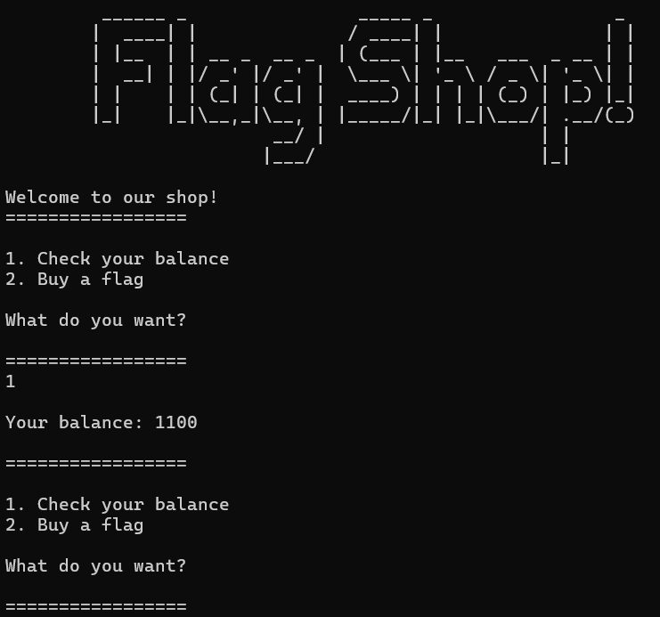
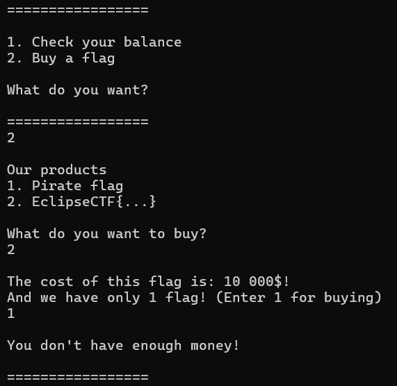
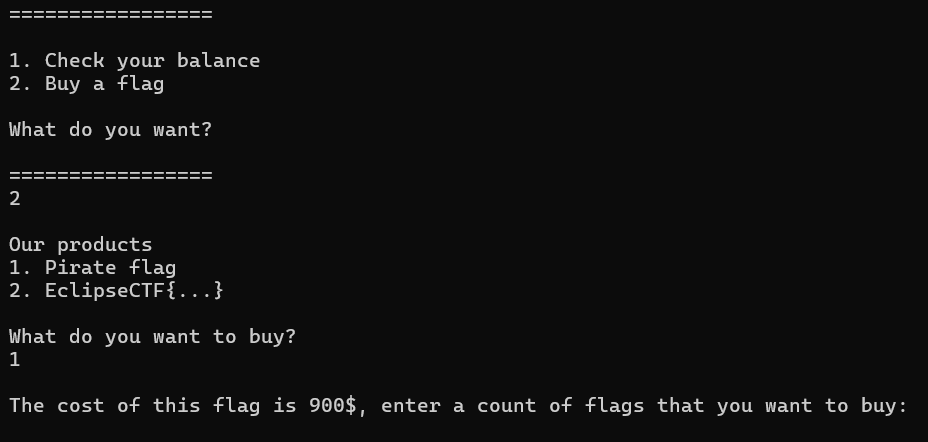
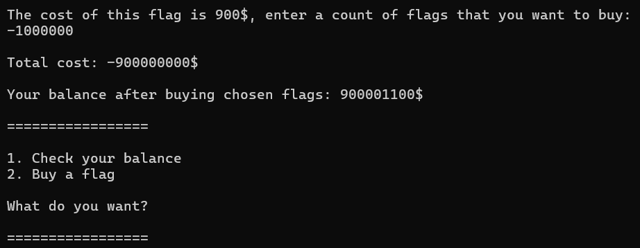
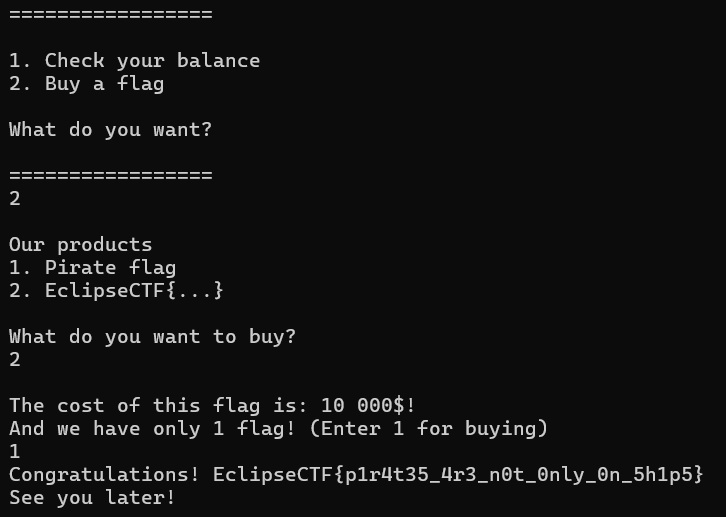

# Flag Shop Inc

***Описание***: Нил Армстронг — американский астронавт NASA, лётчик-испытатель, космический инженер и профессор университета. Он стал первым человеком, ступившим на Луну 20 июля 1969 года в ходе лунной экспедиции корабля «Аполлон-11». Армстронг и его напарник Базз Олдрин совершили выход на поверхность Луны продолжительностью 2 часа 31 минуту 40 секунд. А ещё, во время этой миссии астронавтами был установлен американский флаг на Луне. Вот только мало кто знает - первоначально астронавты забыли флаг на Земле. Глянешь, что там осталось в ассортименте?

Подключение: `nc localhost 13337`

Формат: EclipseCTF{...}

---
### Решение

Подключаемся и проверяем текущий баланс:

У нас 1100 на счету. Перейдем в раздел покупки флагов и попытаемся купить флаг Eclipse:

Как видим, нам надо 10000 на счету. В таком случае попробуем купить другой флаг:

И вот тут останавливаемся, потому что нам надо ввести отрицательное значение (количество покупаемых флагов):

Как видим, итоговая стоимость улетела в отрицательно значение, а баланс пополнился! Осталось купить нужный флаг:

---

***Флаг***: `EclipseCTF{p1r4t35_4r3_n0t_0nly_0n_5h1p5}`