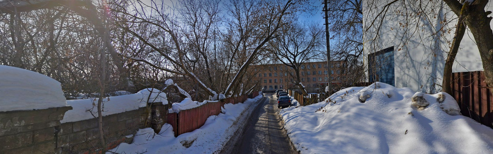

# Mytishchi4ever-1

***Описание***: На днях я ехал в московском метро и обратил внимание на одну интересную деталь - производитель вагонов и поездов. Наверняка интересный завод. Я решил съездить и посмотреть на него, вот только где он находится и как называется?

Формат: EclipseCTF{Название_предприятия-широта-долгота}

Точность координат - 3 знака после запятой

>P.S. мой гид по городу - yandex maps

---
### Решение

Для начала найдем название самого завода, производящего вагоны для московского метро:

Далее остается перейти в Яндекс.Карты и нажать на кнопку `Поделиться` и мы увидим координаты:

Округляем и готово!

---

***Флаг***: `EclipseCTF{Метровагонмаш-55.911-37.765}`