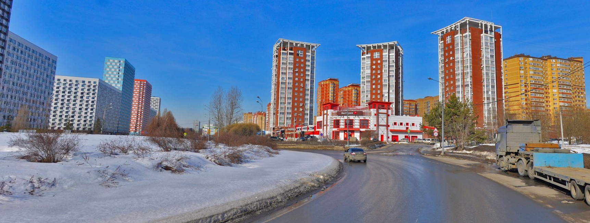
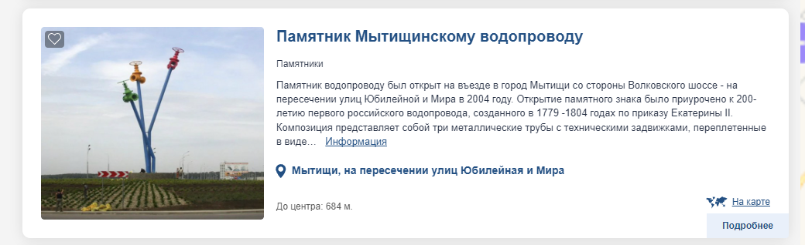
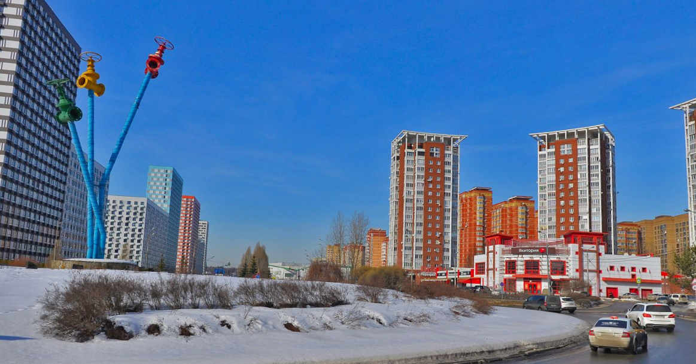

# Mytishchi4ever-3

***Описание***: Дальнейшее мое путешествие по городу привело меня к не менее интересному памятнику, вот только посвящен он не человеку, а предмету! Его название нигде не написано. Помоги найти какому предмету он посвящен?

Формат: EclipseCTF{Предмет}

---
### Решение

Использовать можно как поиск по фото, так и посмотреть по сайтам (как в прошлом таске):

>https://www.komandirovka.ru/sights/mytitshi/monuments/

---

Флаг : `EclipseCTF{Водопровод}`