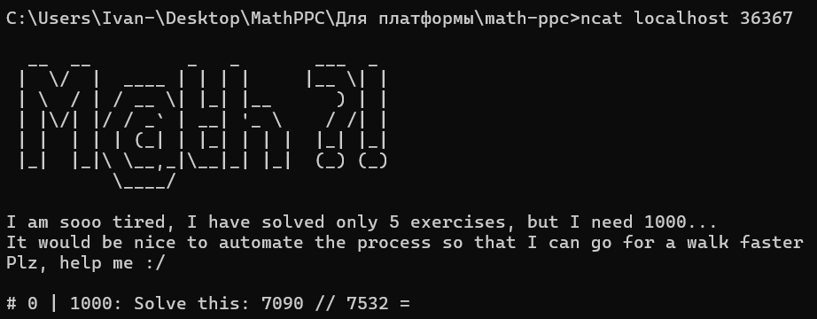
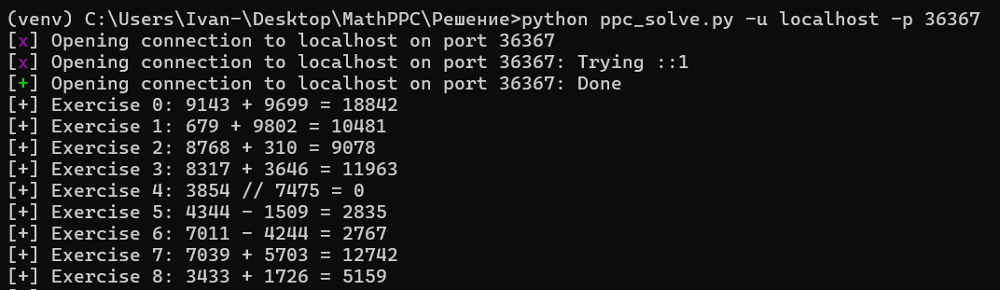
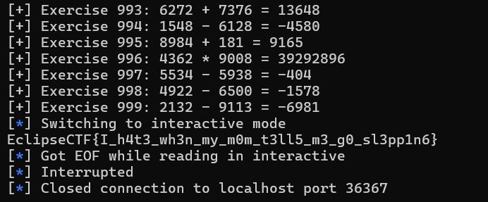

# MathPPC

***Описание***: Ох, как же я устал решать эти примеры... Вы бы знали... Помогиииитеееее!!!

Подключение: `nc localhost:36367`

Формат: EclipseCTF{...}

---
### Решение

Подключаемся к ресурсу:



Нам необходимо решить 1000 примеров, причем все один крайне простые. Сплойт для решения таска:

```python
import argparse
from pwn import *


# Аргументы эксплойта
parser = argparse.ArgumentParser()

parser.add_argument("-u", "--host", help="IP-address or domain name", required=True)
parser.add_argument("-p", "--port", help="A port number", required=True)

args = parser.parse_args()


# Подключение к хосту средствами библиотеки pwn
connection = remote(args.host, args.port)


# В задании указано число заданий (1000), поэтому создаем цикл
for i in range(0, 1000):

    # Получаем сообщение от сервера и разделяем его на части при помощи .split()
    message = connection.recv().split()
    # print(message)

    # Сервер присылает упражнение, соответственно, забираем из него числа и операцию, которую надо провести над ними. Пример:
    # [b'#', b'96', b'|', b'100:', b'Solve', b'this:', b'1179', b'*', b'9404', b'='] - полученное сообщение от сервера
    # message[-4] = 1179
    # message[-3] = *
    # message[-2] = 9404
    # Считаем все с помощью функции eval()
    result = eval((message[-4]).decode() + message[-3].decode() + message[-2].decode())

    # Отладка
    print(f"[+] Exercise {i}:", message[-4].decode(), message[-3].decode(), message[-2].decode(), "=", result)

    # Отправка ответа серверу
    connection.send(str(result).encode())


# Захват флага после всех решенных математических выражений
connection.interactive()

# Альтернативный вариант захвата флага
# print(connection.recv())
```

Результат:





>P.S. в процессе отборочных таск был сокращен до 100 итераций

---

***Флаг***: `EclipseCTF{I_h4t3_wh3n_my_m0m_t3ll5_m3_g0_sl3pp1n6}`