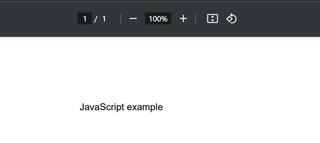
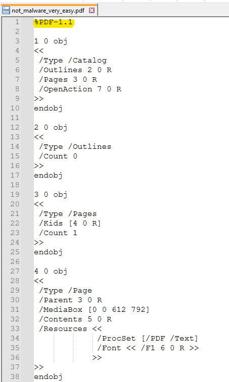
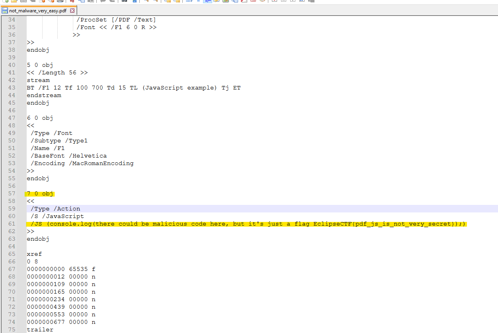
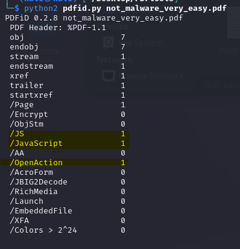
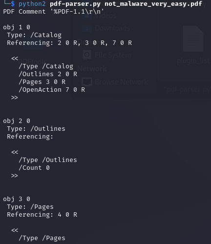

# PDFLover

***Описание***: (Не)Вредоносный PDF-файл. Может ли он что-то нам сказать?

Формат: EclipseCTF{...}

---
### Решение

И так, нам дали `pdf-файл`. Откроем его, в песочнице и увидим содержимое. 1 страница, и текст `JavaScript example` намекающий на то, что где-то в этот pdf встроен JS код

Окей, откроем PDF в виде текста. Нас встретит структура PDF файлов: объекты, стримы и т.п. про это подробнее всегда можно почитать. А если кратко и в картинке, то вот схема того как выглядит всё внутри. 

В нашем случае блок заголовков очень краткий (Header) и представляет собой версию PDF. А вот body уже содержит объекты и информацию о них, вот, например `obj - object` с `id 1` и типом `/catalog`

Просмотрим весь PDF и все его объекты, найдём `object 8`, с типом `/action` и это `JS code`. В самом коде нам сообщают, что это мог бы быть вредоносный код, но тут только флаг.

Открыть блокнотом и увидеть флаг - детский уровень, использовать утилиту и провести мини-аналитику уже школьный. Будем стремиться хотя бы к этому!

Если использовать навыки поиска информации в поисковых системах и утилит для анализа PDF-файлов, мы неизбежно наткнёмся на стэк python-скриптов для анализа. Например [PDF-tools](https://blog.didierstevens.com/programs/pdf-tools/). Используем `pdfid` и увидим что в нашем PDF есть `JS-объекты` и действие исполняемое при открытии. 

Используем `pdf-parser`. В целом, он сделает то же самое, что и открытие блокнотом, но у него есть несколько интересных флагов для дополнительного анализа. Их использование оставлю читателю на мини-ресёрч, один из них рассмотрим в другом таске. 

---

***Флаг***: `EclipseCTF{pdf_js_is_not_very_secret}`