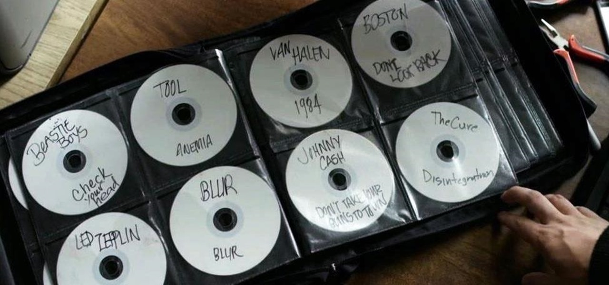
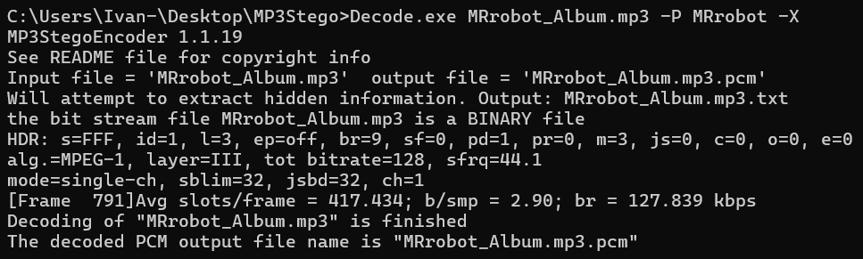
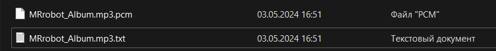
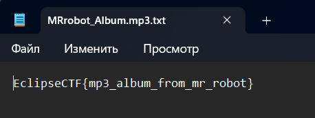

# my loved album

***Описание***: Любимый альбом или чистой воды досье...



Формат: EclipseCTF{...}

---
### Решение

Участнику выдан файл `MRrobot_Album.mp3`. Содержимое его не понятно, поэтому обращаемся к инструментам. Мы будем использовать `MP3stego`:

>https://www.petitcolas.net/steganography/mp3stego/

Usage: https://ctf-wiki.mahaloz.re/misc/audio/introduction/

```powershell
Decode.exe MRrobot_Album.mp3 -P MRrobot -X
```



В результате получаем `.pcm` и `.txt` файлы. В последнем и находим флаг:



]

---

***Флаг***: `EclipseCTF{mp3_album_from_mr_robot}`